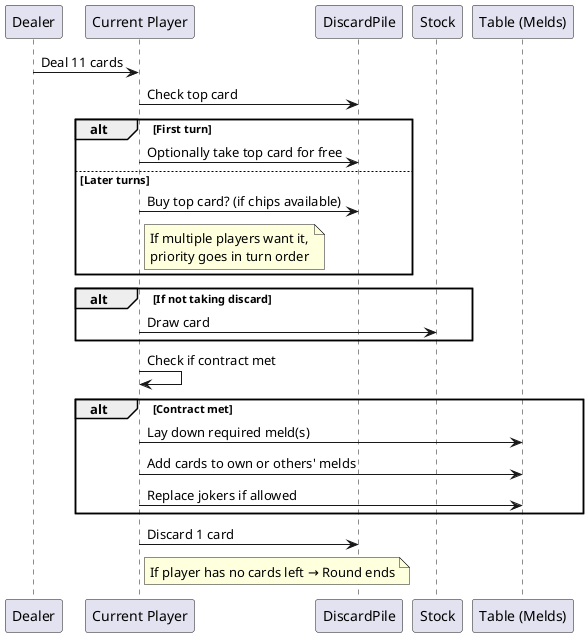
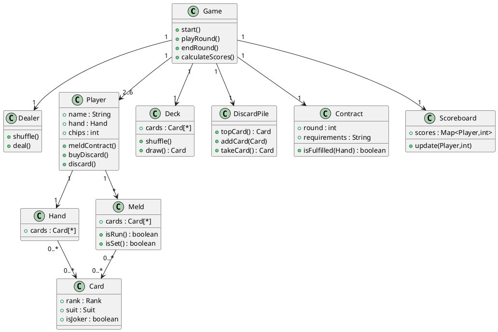
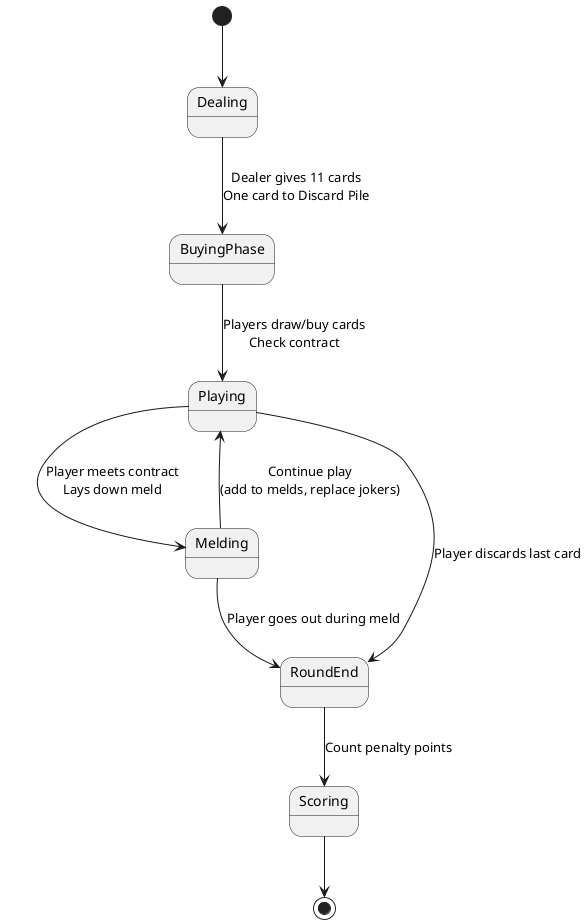

# Telefunken 
> A contract rummy game, resembling Continental Rummy, where players must complete specific melds (sets and runs) in each of seven rounds—or "deals"—to go out and score zero points 

<a href=sample> Sample GUI </a>

## Cards and Players
- Uses two standard decks plus jokers, totaling 108 cards
- For 3–4 players, that stack is standard; larger games may require three decks 
- Players also start with a limited number of buying chips (usually 7) that allow them to "buy" discards 

## Typical Contracts (Dealing Rules)
- Each deal has a specific contract that must be met before melding:
    - Deal 1: One pure trio (three-of-a-kind, no joker)
    - Deal 2: Two trios
    - Deal 3: One quartet (four-of-a-kind)
    - Deal 4: Two quartets
    - Deal 5: One quintet (five-of-a-kind)
    - Deal 6: Two quintets
    - Deal 7: A trio + a run of 7+ cards 

A pure trio in Deal 1 must consist of three cards of the same rank but different suits, with no jokers allowed.

## Gameplay Flow
- Dealer shuffles and deals (each gets 11 cards, and one card starts the discard pile) 
- The player to the dealer's right starts and turns continue counterclockwise 
- On your turn:
    - Draw from the stock, or (if it's your first turn) take the face-up discard for free.
    - Optionally buy the discard (before your first meld) using a chip; if multiple players want it, priority is given based on turn order
    - Once able to meet the contract, you meld your contract, then you may add to your own or others' melds and extend runs/sets (jokers can be swapped in and out under certain rules) 
- Finally, discard one card to end your turn.
- Play continues until someone discards their last card (having completed their melds). Other players score penalty points based on remaining cards 
- Typically played over seven deals, and the lowest total penalty wins 

### Sequence Diagram 

### Model

### State Diagram
