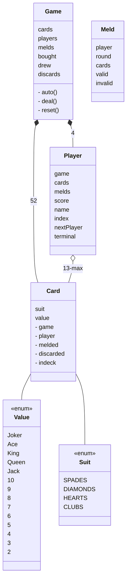

# Business Model

```mermaid
classDiagram

    Game *-- Player : 4
    Game *-- Card : 52

    class Game {
        cards
        players
        melds
        bought
        drew
        discards
        - auto()
        - deal()
        - reset()
    }

    Player o-- Card : 13-max
    class Player {
        game
        cards
        melds
        score
        name
        index
        nextPlayer

        terminal
    }

    class Meld {
        player
        round
        cards
        valid
        invalid
    }

    class Suit { 
        SPADES
        DIAMONDS
        HEARTS
        CLUBS
    }

    <<enum>> Suit

    class Value {
        Joker

        Ace
        King
        Queen
        Jack

        10
        9
        8
        7
        6
        5
        4
        3
        2
    }
    <<enum>> Value
    
    Card -- Value
    Card -- Suit
    class Card {
        suit
        value
        - game
        - player
        - melded
        - discarded
        - indeck
    }


```
